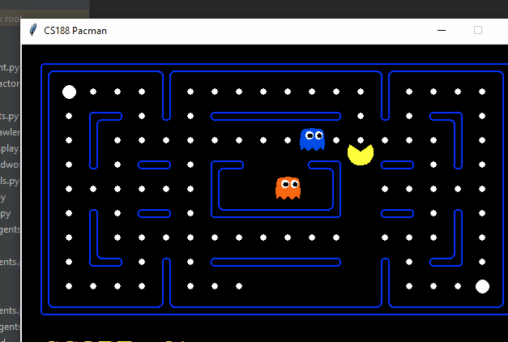

# Reinforcement learning agent

The files edited by me are **analysis.py**, **qlearningagents.py** and **valueIterationAgents.py**

By implementing a reinforcement learning algorithm, the following pacman agent was trained in just 50 games:

Attribution to UC Berkeley
# http://inst.eecs.berkeley.edu/~cs188/pacman/pacman.html
